# Space Invaders

This website was developed to display the game Space Invaders, a spaceship shooter game. Users may visit this website to experience playing the classic retro game of space invaders with some unique twists - such as directed enemy fire. The target audience for this game is those seeking a classic retro arcade game fix or simply those looking for a simple and quick slice of entertainment. The site displays local high scores which adds a competitive element to the game. Additionally, the aliens that shoot at the player do so with with increasing speed, this feature adds a drive to complete the game faster as the game gets increasingly more difficult with time.

To experience the game, please visit the deployed site [here](https://antonia-white.github.io/space-invaders/).

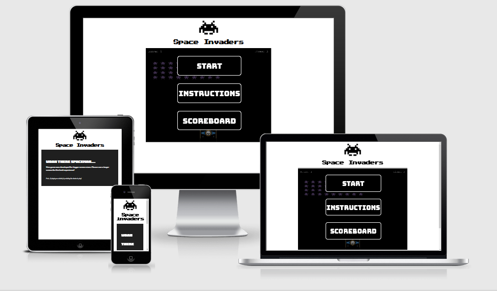

***

## User Stories

As a user of the Space Invader game, I want to:
  1. have fun playing the game
  2. have easy to use controls to play the game with
  3. visit a retro looking game for an enjoyable/nostalgic experience
  4. navigate through the website and game easily and fluidly
  5. access instructions on how to play the game and game aims
  6. see a scoreboard of local highscores

***

## UX

### Colour Scheme
- A simple, dark, space-like black and contrasting white with some purple, yellow and blue elements for a pop of colour. This colour palette aims to give a classic retro feel.
    >
- No accessibility issues were returned when passing the colour scheme through the official [WebAIM](https://webaim.org/resources/contrastchecker/).
    >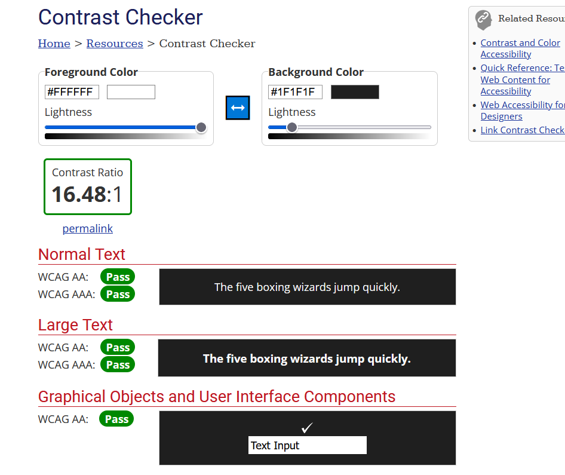

### Typography

- Google Fonts
  Font styles were taken from the open source [Google Fonts](https://fonts.google.com/).
  - The typography for Space Invaders logo is font-family [Press+Start+2P](https://fonts.google.com/specimen/Press+Start+2P). This font design is based on the font designs from 1980s Namco arcade games. This gives the logo a classic retro gaming feel which is what I aimed to acheive with space invaders.
  - The typography for the heading elements within the website is font-family [Bungee](https://fonts.google.com/specimen/Bungee). This font design shares characteristics of the Press+Start+2P design giving the website a holistic design. This font is a more readable but still game-ified design. The weight and capitalization of the font makes it a great choice for eye-catching headings.
  - The typography for other text on the website is font-family [Coda](https://fonts.google.com/specimen/Coda). This font design is clean, unassuming and practical. The style merges well with the Bungee font-family and has a less impactful presence on the screen.

***

### Wireframes

- Welcome wireframe in desktop view

 

- Instructions wireframe in desktop view

 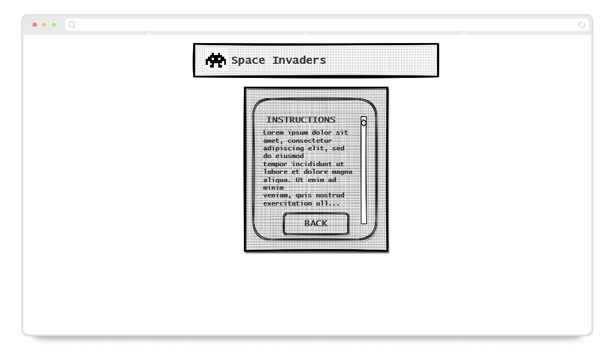

- Scoreboard wireframe in desktop view

 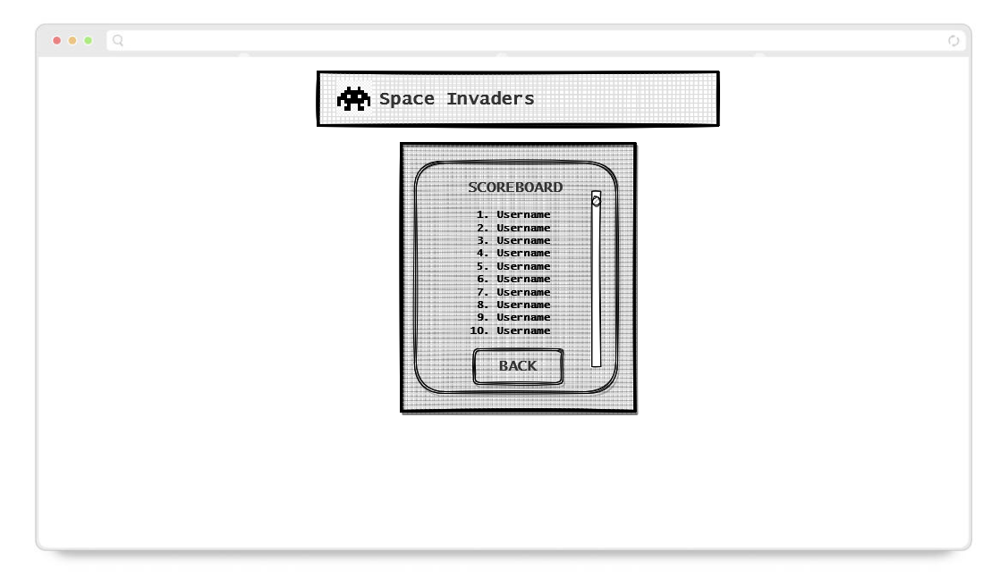

- Gameplay wireframe in desktop view

 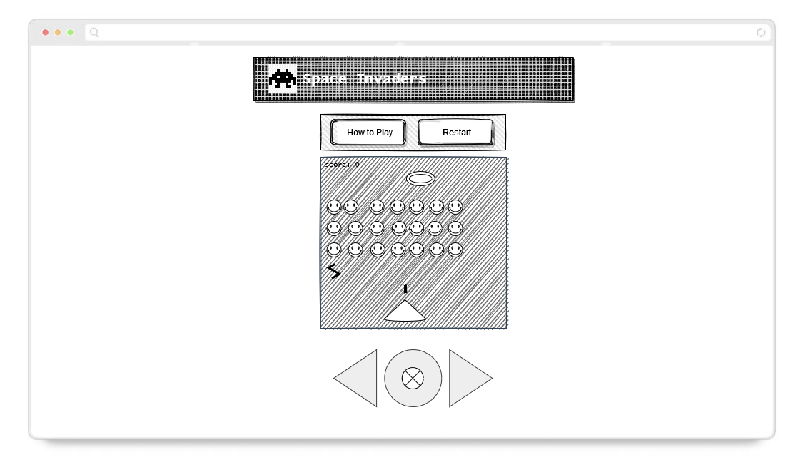

- Gameplay wireframe in mobile view

 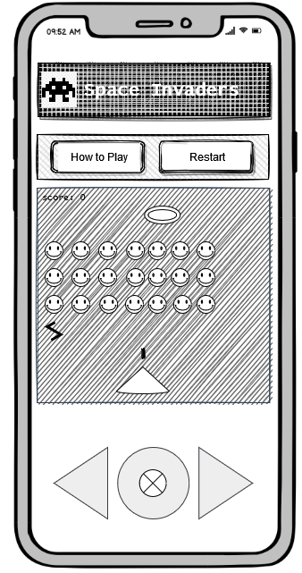

***

## Features 

### Existing Features 

- __Home Menu__

  - The home menu modal loads when the window loads. It overlays the game area. The home menu has three buttons: the start button, the instructions button, and the scoreboard button.
  - The home menu allows the user to navigate around the modals and/or start gameplay. Clicking the start button will close the modal and begin gameplay. Clicking the instructions button will close the home menu modal and reveal the instructions modal. Clicking the scoreboard button will close the home menu modal and reveal the scoreboard modal.

    >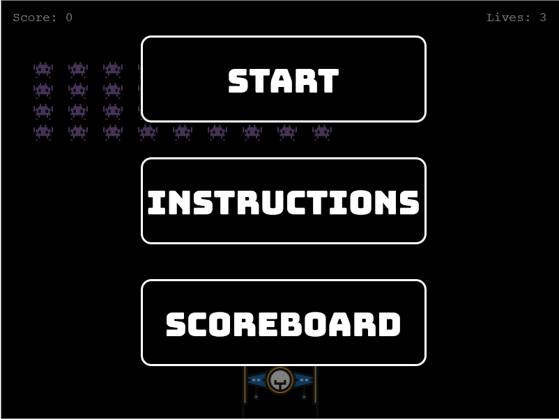

- __Instructions__

  - The instructions modal loads when the instructions button on the home modal is clicked. The instructions overlay the game area. The instructions modal has scrollable text and a back button.
  - The instuctions modal content holds instructions and controls on how to play space invaders, whether on a keyboard or touchscreen device. The text is written as if it is an incoming message to the spaceship (the ship represents the player in the game), this allows some pre-text to the game to be established and gives a more immersive experience. The back button allows users to navigate back to the home menu - the back button closes the instructions modal and loads the home menu modal.

    >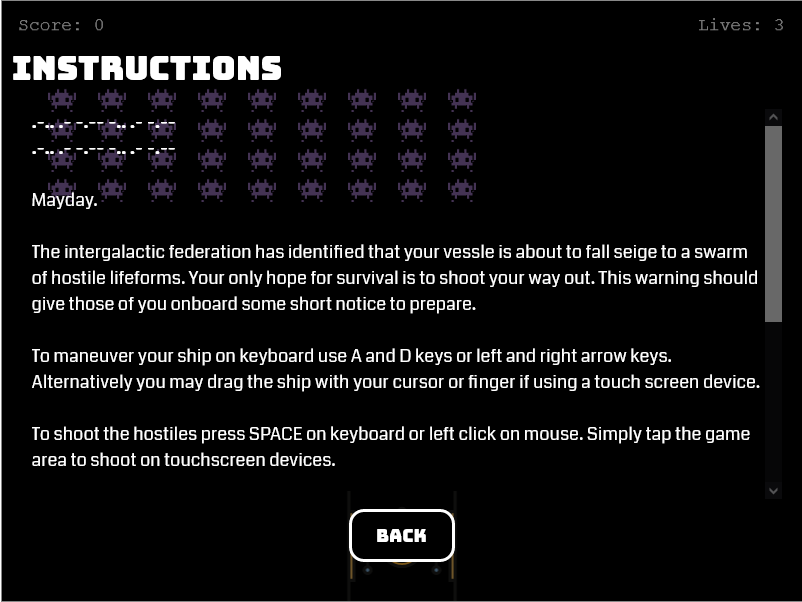

- __Scoreboard__

  - The scoreboard modal loads when the scoreboard button on the home modal is clicked. The scoreboard overlays the game area. If there is no cache in local storage of previous gameplay (i.e., if it is the first time playing the game) the scoreboard will display text indicating that there are no highscores (see below screenshot). If there is local storage of previous scores a list will show the top 10 highscores for the game (see below screenshot). The scoreboard also has a back button.
  - The scoreboard allows users to keep a record of previous highscores on that device. This adds a competitive element to the game, aiming to get a higher and higher highscore. The back button allows users to navigate back to the home menu - the back button closes the scoreboard modal and loads the home menu modal.
  - The scoreboard modal utilises the built-in Web API [Window.localStorage](https://developer.mozilla.org/en-US/docs/Web/API/Window/localStorage) to retrieve stored highscores (stored in a UTF-16 DOMString format) across browser sessions.

    >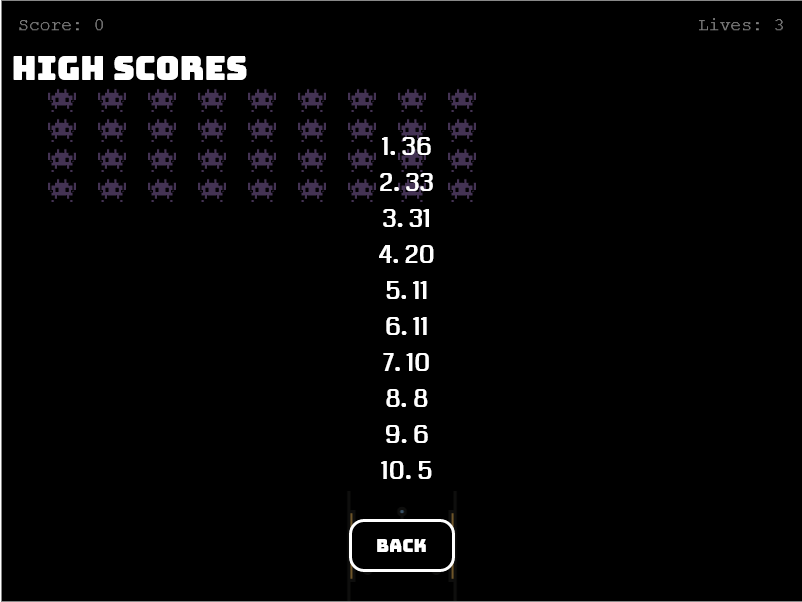
    >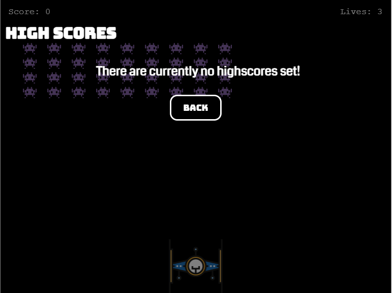

- __The Game__

  - The game is space invaders and is the main content of the website. The player in this game is a spaceship which can move on a horizontal axis at a limited velocity. The aim of the game is to clear the game area of alien enemies (which shoot directly towards the player and also move on a horizontal axis). The player must dodge oncoming fire to survive. The player can return fire to destroy enemy aliens. UFOs will occasionally fly above, these hostiles have a higher rate of fire and their fire has a higher velocity (aka harder to dodge). The game gets progressively more difficult with time as the velocity of enemy alien fire increases with every shot that the aliens take.
  - The purpose of the game is to entertain.
  - The game was built using [Phaser 3 API](https://photonstorm.github.io/phaser3-docs/).

    >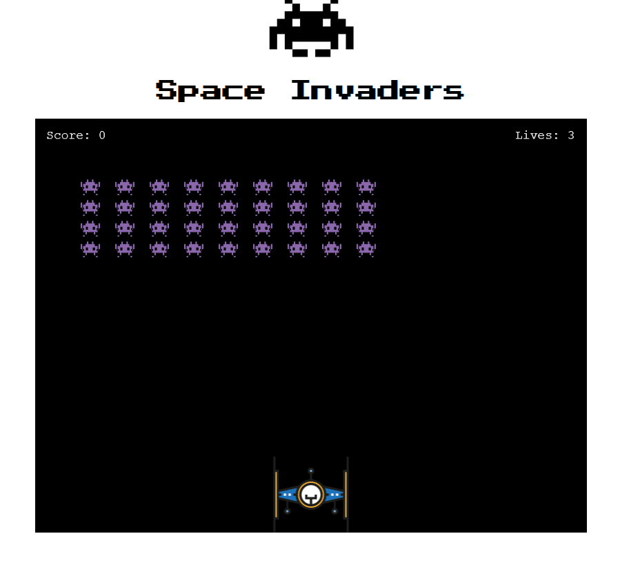

- __Score Counter__

  - The score counter displays the users current score. A sound is played when an alien is hit.

    >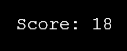

- __Lives Counter__

  - The lives counter displays the users current lives. The players spaceship will flash red and a sound will play to indicate a lost life, so that the user doesn't have to keep referring back to the lives counter. Once the counter hits 0 it's game over.

    >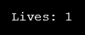

- __Sound Settings__
  
  - The sound settings are found on the Home Menu. This feature allows users to toggle game sounds on or off, depending on their personal preference. The default setting is audio off. An icon will appear above the slider to inform the user of the current setting applied.

    >
    > 

### Features Left to Implement 

- Online scoreboard
  - The scoreboard would show usernames and scores of players globally who have acheived the highest scores.
  - This feature would change the scoreboard from being on local storage (i.e., presumably one player on the one device) to global online storage. This would expand competition beyond local to competition with all other users of the site.
  - I currently do not have the knowledge to implement this.

- Improved accessibility for mobile gaming
  - While designing space invaders I made the conscious decision to keep the game area a 800px x 600px box across all devices. This was to maintain the classic retro arcade game feel. Having the game fill the whole viewport would make the game more accessible to other devices but I feel it hinders the gameplay quality, makes the gameplay feel more modern and doesn't the experience I wanted to acheive.
  - Some users may not have access to devices with larger screen sizes so it is important to implement accessibility for mobile users.
  - This feature hasn't been implemented as I feel it currently retracts from the gaming experience. With additional time and experimentation I would work to facilitate space invaders gameplay to suit a mobile device.

- Enemy laser svg rotation towards player's spaceship
  - As you can see in current gameplay, when an alien laser is fired the laser.svg moves directly towards the player. However, the laser.svg does not rotate towards the player and remains facing directly down.
  - Adding rotation of the laser would increase immersion resulting in a better gaming experience.
  - With additional time and research I would implement this feature.

- Fix laser bug. Please refer to [TESTING.md](TESTING.md).

- Reduce velocity of spaceship when dragging
  - Provide air resistance to dragging the spaceship with a cursor or finger on touchscreen devices. At present, because of this gameplay is currently easier on tablet. 
  - This is a finicky feature to implement and one I haven't been successful with so far. I would achieve this with more time by researching articles such as [this](https://dustinpfister.github.io/2018/10/30/phaser-physics-drag/).

***

## Technologies
- [HTML](https://en.wikipedia.org/wiki/HTML) was used as the markup language
- [CSS](https://en.wikipedia.org/wiki/CSS) was used for styles
- [JavaScript](https://en.wikipedia.org/wiki/JavaScript) was used for website interactivity
- [GitPod](https://gitpod.io) was used as a cloud based iDE
- [GitHub](https://github.com/) was used to manage the Git repository
- [GitHub Pages](https://antonia-white.github.io/space-invaders/) was used for deployment
- [Git](https://git-scm.com/) was used for version control
- [Am I Responsive](http://ami.responsivedesign.is/) was used to generate a mockup image
- [Window.localStorage](https://developer.mozilla.org/en-US/docs/Web/API/Window/localStorage) is a built-in Web API used for storing and retrieving local highscores
- [Dev Tools](https://en.wikipedia.org/wiki/Web_development_tools) was used for testing and responsiveness
- [iloveimg](https://www.iloveimg.com/) was used for resizing and cropping svg images

***

## Testing

To view all testing documentation, refer to [TESTING.md](TESTING.md).

***

## Deployment

The site was deployed to GitHub pages. The steps to deploy are as follows: 
  - In the [GitHub repository](https://github.com/antonia-white/space-invaders), navigate to the Settings tab.
  - From the source section drop-down menu, select the **Main** Branch, then click "Save".
  - The page will be automatically refreshed with a detailed ribbon display to indicate the successful deployment.

The live link can be found [here](https://antonia-white.github.io/space-invaders/)

### Local Deployment

In order to make a local copy of this project, you can clone it. In your IDE Terminal, type the following command to clone the repository:

- `git clone https://github.com/antonia-white/space-invaders.git`

Alternatively, if using Gitpod, you can click below to create your own workspace using this repository.

[](https://gitpod.io/#https://github.com/antonia-white/space-invaders)

### How to Install Jest
In the terminal create a json file by running:
```
npm init
```
Click through the default configurations, set Jest as the test command by entering the string "jest" when cued.

Once this is done, to install Jest as a development dependency run:
```
npm i --save-dev jest
```
To run Jest and the built tests simply run:
```
npm test
```
in the terminal.

Note: You may need to manually install the jsdom environment. To do this simply run:
```
npm i jest-environment-jsdom
```
in the terminal when prompted after Jest installation.

You can read more about how to set up Jest using their [official documentation](https://jestjs.io/docs/getting-started).

***

## Credits 

### Content 

- All text throughout the website is self-written.
- The framework used to create space invaders was [Phaser 3 API](https://photonstorm.github.io/phaser3-docs/) which has amazing documentation that I used extensively e.g.:
  - [To calculate enemy fire velocity from rotation](https://newdocs.phaser.io/docs/3.55.2/focus/Phaser.Physics.Arcade.ArcadePhysics-velocityFromRotation)
  - [To check collision overlaps between sprites](https://phaser.discourse.group/t/check-collision-overlap-between-sprites-without-physics/6696/3)
- Various snippets of code adapted from helpful posters on [Stack Overflow](https://stackoverflow.com/), including but not limited to:
  - [Centering a Phaser game in browser](https://stackoverflow.com/questions/51309375/how-do-i-move-phaser-game-to-the-center-of-a-browser)
  - [Array manipulation and sorting](https://stackoverflow.com/questions/1063007/how-to-sort-an-array-of-integers-correctly)
- Various snippets of code from users of other sites, including but not limited to:
  - [Flashing a sprite at HTML 5 Gave Devs](https://www.html5gamedevs.com/topic/44310-why-flashing-black-instead-of-red-in-this-tween/)
- Multiple useful articles at [w3schools](https://www.w3schools.com/), including but not limited to:
  - [How to create a toggle switch](https://www.w3schools.com/howto/howto_css_switch.asp)
- Using and manipulating data in local storage was taught by James Q Quick's tutorial found [here](https://www.youtube.com/watch?v=DFhmNLKwwGw&t=543s).
- Game logic was influenced by vbs office's tutorial found [here](https://www.youtube.com/watch?v=8xMBzj8uZ7o&list=LL&index=1).

### Media

- Wireframes were generated with [Draw.io](https://app.diagrams.net/)
- The favicon image is from the open source site [Favicon.io](https://favicon.io/emoji-favicons/herb)
- The responsive design mockup was generated with [Am I Responsive Design](http://ami.responsivedesign.is/#)
- The colour palette was generated with [Color Combos](https://www.colorcombos.com/)
- SVG files were taken from the open source site [SVG Repo](https://www.svgrepo.com/)
- SVG files were resized with [iloveimg](https://www.iloveimg.com/)
- Audio files were taken from [Mixkit's free open source arcade sound effects](https://mixkit.co/free-sound-effects/arcade/)

### Acknowledgments

- My mentor Tim
- My friends and family for testing the site and helping me identify bugs
- Sean and Kevin at Code Institute's tutoring support for their help with using Jest.

***
