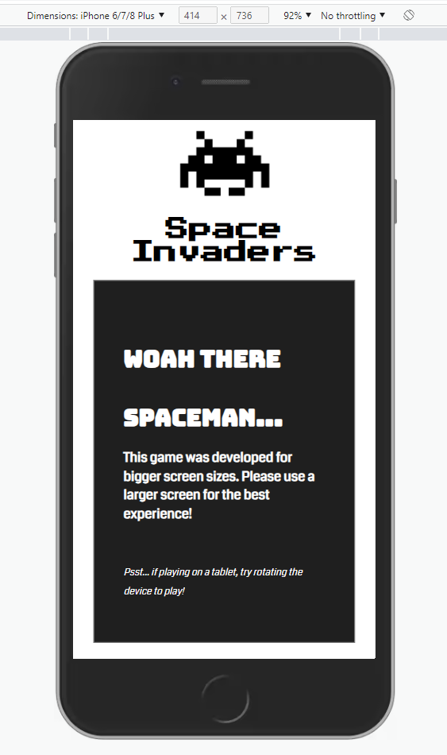
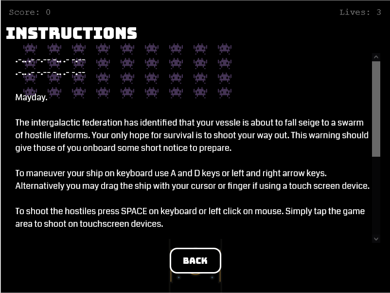

# Testing 

***

## Validator Testing 

- HTML
  - No errors were returned in the index.html file when passing through the official [FreeFormatter's Validator](https://www.freeformatter.com/html-validator.html)

    >


- CSS
  - No errors were found when passing through the official [Jigsaw validator](https://jigsaw.w3.org/css-validator/validator?uri=https%3A%2F%2Fantonia-white.github.io%2Fspace-invaders%2F&profile=css3svg&usermedium=all&warning=1&vextwarning=&lang=en)
  
    >


- JavaScript
  - No errors were found when passing through the official [JSHint](https://jshint.com/)
  - The validator service wasn't able to recognise references to the Phaser 3 API, resulting in an incorrect result from JSHint of 24 undefined variables and one unused variable.
    >

***

## Unfixed Bugs 

Sporadically throughout gameplay the laser image (laser.svg) which represents player fire and enemy fire will be reduced in size - appearing fainter. This isn't the case for all lasers fired. I currently don't know what causes this issue. However, it doesn't have a major impact on gameplay.

***

## Browser Compatability

- Website launched successfully on [Firefox](https://www.mozilla.org/en-GB/firefox/new/):

  >

- Website launched successfully on [Google Chrome](https://www.google.com/intl/en_uk/chrome/):

  >

- Website launched successfully on [Microsoft Edge](https://www.microsoft.com/en-us/edge):

  >

During manual testing I noticed the modal overlay wasn't perfectly alligned across the game area - resulting in a an overspill of the modal. This bug was replicated in Chrome and Edge. To improve compatibility across these browsers I implemented the following code:
```json
if ((window.navigator.userAgent.indexOf("Chrome") > -1) || (window.navigator.userAgent.indexOf("Edge/") > -1)) {
    let modalContent = document.getElementsByClassName("modal-content");
    for (var i = 0; i < modalContent.length; i++) {
        modalContent[i].style.margin = "186px auto";
    }
}
```
When the browser being used is Chrome or Edge, this code will target the divs with the class name "modal-content". The code loops through all elements with this class name to change the margin of the div to realign the modal content to fit perfectly ontop of the game - without impacting deployments on Firefox.
***

## Responsiveness

- Website viewed in a mobile device:

  >

- Website viewed in a tablet device:

  >

- Website viewed in a laptop device:

  >


***

## User Story Testing

A target user of the Space Invaders game will want to:
- [x] have fun playing the game
   >The game space invaders was designed for entertainment.

- [x] have easy to use controls to play the game with
   >Space invaders has easy to use controls accessible for keyboard and touchscreen. These controls are outlined in the instructions modal. For the user to move their spaceship on keyboard they can use A and D keys or left and right arrow keys. Alternatively a user can drag the ship with their cursor or finger if using a touch screen device. To activate the game mechanic to shoot the hostiles, a user can press SPACE on keyboard or left click on mouse. If using a touchscreen device a user can tap the game area.

- [x] visit a retro looking game for an enjoyable/nostalgic experience
   >The classic, simple look of the game alongside the logo design reminiscent of 1980s Namco arcade games acheives this.
   

- [x] navigate through the website and game easily and fluidly
   >The home menu modal allows for simple navigation between modals with the click of a button. Back buttons on the instructions and scoreboard modals allow for navigation back to the home menu. Clciking the start button allows the user to begin gameplay.
   

- [x] access instructions on how to play the game and game aims
   >Details are given in the instructions modal.
   

- [x] see a scoreboard of local highscores
   >A list of top 10 high scores are listed in the scoreboard modal.
   

***
