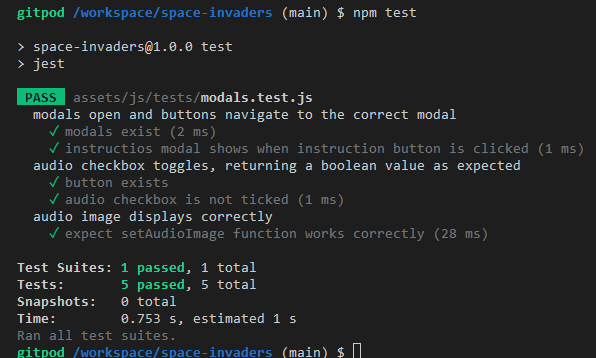
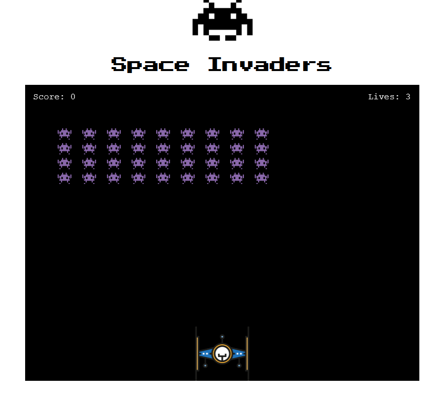

# Testing 

***

## Validator Testing 

- HTML
  - No errors were returned in the index.html file when passed through the official [W3C's HTML Validator](https://validator.w3.org/nu/?doc=https%3A%2F%2Fantonia-white.github.io%2Fspace-invaders%2F).

    >


- CSS
  - No errors were found in the style.css file when passed through the official [Jigsaw validator](https://jigsaw.w3.org/css-validator/validator?uri=https%3A%2F%2Fantonia-white.github.io%2Fspace-invaders%2F&profile=css3svg&usermedium=all&warning=1&vextwarning=&lang=en).
  
    >


- JavaScript
  - No errors were found when both script.js and modal.js files were passed through the official [JSHint](https://jshint.com/).
  - The validator service wasn't able to recognise references to the Phaser 3 API in the file script.js, resulting in an incorrect result from JSHint of 24 undefined variables and one unused variable.
    >
    >

***

## Automated Testing 

Automated tests were ran using the Jest framework. I fully acknowledge and understand that, in a real-world scenario, an extensive set of Jest tests would be more comprehensive. Space Invaders was built using Phaser's JS library. Unfortunately Jest isn't currently 100% compatible with Phaser. At present Jest identifies any keywords that the Phaser 3 API uses as "undefined variables" and will not run past them. I made many attempts to configure Jest to be compatible with Phaser - including installing Phaser to the Node Package Manager by running the following in the terminal:
```
npm i phaser
```
You can read more about this method of Phaser installation [here](https://designcode.io/phaser-course).
I also attempted to export functions that exclude any mention of Phaser but this wasn't possibe. As to my knowledge and extensive reading online, there is no current way to use Jest to test Phaser games. Interestingly, I have read some discussions online that call into question the basic automated testibility of Phaser games. 

In hindsight, if I had known about the new change to marking criteria before starting and making considerable progress with this website, I would have developed a game using an API that was compatible with Jest or alternatively I would have created a simpler game or quiz in vanilla JavaScript so that I could meet the assessment criteria to a higher standard.

However, having not had that foresight, I have been able to test some JavaScript functionality by moving the code that controls modal functionality (i.e., the code that controls the display of each modal) into a new js file named "modals.js". This file (and of course the index.html file) is what was tested with Jest.

### Space Invaders Jest Tests
To see the tests that were conducted please refer to [modals.test.js](modals.test.js).

- Test that the modals exist in the html file
  - The user will not be able to start the game or navigate around the modals if the modals are not defined.
    ```js
    test("modals exist", () => {
            expect("homeModal" in document).toBeDefined();
            expect("instructionsModal" in document).toBeDefined();
            expect("scoreboardModal" in document).toBeDefined();
            expect("endGameModal" in document).toBeDefined();
        });
    ```

- Test that the audio toggle exists in the html file
  - The user will not be able to toggle audio on and off if the checkbox is not defined in the html.
    ```js
    test("button exists", () => {
            expect("audio-check" in document).toBeDefined();
        });
    ```

- Test that the audio toggler (i.e. checkbox) default loads as off (i.e. the checkbox returns false)
  - The default setting for the game will be audio off. The user can then toggle audio on/off at will.
    ```js
    test("audio checkbox is not ticked", () => {
          expect("audio-check" in document).toBeFalsy();
      });
    ```

- Test that the setAudioImage function works
  - This function displays the appropriate image when a user has toggled the audio to on/off. The image displayed shows the user if sound for the game has been enabled or not. The default setting is sound off (see above test). When the user turns sound on an icon should display to inform the user of their change.
    ```js
     describe("audio image displays correctly", () => {
     beforeAll(() => {
         let checkbox = document.getElementById("audio-check");
         checkbox.checked = true;
         setAudioImage(checkbox);
     });
     test("expect setAudioImage function works correctly", () => {
         const audioOffImage = window.getComputedStyle(document.getElementById("audio-off-img")).getPropertyValue('display');
         const audioOnImage = window.getComputedStyle(document.getElementById("audio-on-img")).getPropertyValue('display');
         expect(audioOffImage).toEqual("none");
         expect(audioOnImage).toEqual("block");
     });
    ```

Screenshot of these Jest tests running in the terminal:
>

***

## Unfixed Bugs 

Sporadically throughout gameplay the laser image (laser.svg) which represents player fire and enemy fire will be reduced in size - appearing fainter. This isn't the case for all lasers fired. I currently don't know what causes this issue. However, it doesn't have a major impact on gameplay.

***

## Browser Compatability

- Website launched successfully on [Firefox](https://www.mozilla.org/en-GB/firefox/new/):

  >

- Website launched successfully on [Google Chrome](https://www.google.com/intl/en_uk/chrome/):

  >

- Website launched successfully on [Microsoft Edge](https://www.microsoft.com/en-us/edge):

  >

During manual testing I noticed the modal overlay wasn't perfectly alligned across the game area - resulting in a an overspill of the modal. This bug was replicated in Chrome and Edge. To improve compatibility across these browsers I implemented the following code:
```js
if ((window.navigator.userAgent.indexOf("Chrome") > -1) || (window.navigator.userAgent.indexOf("Edge/") > -1)) {
    let modalContent = document.getElementsByClassName("modal-content");
    for (var i = 0; i < modalContent.length; i++) {
        modalContent[i].style.margin = "186px auto";
    }
}
```
When the browser being used is Chrome or Edge, this code will target the divs with the class name "modal-content". The code loops through all elements with this class name to change the margin of the div to realign the modal content to fit perfectly ontop of the game - without impacting deployments on Firefox.
***

## Responsiveness

- Website viewed in a mobile device:

  >

- Website viewed in a tablet device:

  >

- Website viewed in a laptop device:

  >


***

## User Story Testing

A target user of the Space Invaders game will want to:
- [x] have fun playing the game
   >The game space invaders was designed for entertainment.

- [x] have easy to use controls to play the game with
   >Space invaders has easy to use controls accessible for keyboard and touchscreen. These controls are outlined in the instructions modal. For the user to move their spaceship on keyboard they can use A and D keys or left and right arrow keys. Alternatively a user can drag the ship with their cursor or finger if using a touch screen device. To activate the game mechanic to shoot the hostiles, a user can press SPACE on keyboard or left click on mouse. If using a touchscreen device a user can tap the game area.

- [x] visit a retro looking game for an enjoyable/nostalgic experience
   >The classic, simple look of the game alongside the logo design reminiscent of 1980s Namco arcade games achieves this.
   

- [x] navigate through the website and game easily and fluidly
   >The home menu modal allows for simple navigation between modals with the click of a button. Back buttons on the instructions and scoreboard modals allow for navigation back to the home menu. Clicking the start button allows the user to begin gameplay.
   

- [x] access instructions on how to play the game and game aims
   >Details are given in the instructions modal.
   

- [x] see a scoreboard of local highscores
   >A list of top 10 high scores are listed in the scoreboard modal.
   

***
